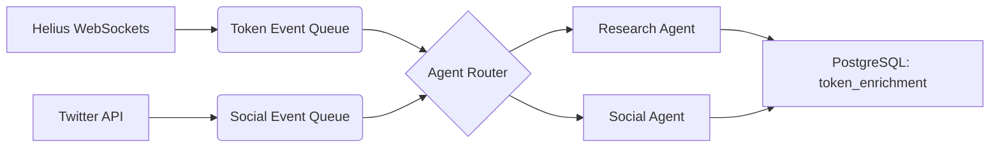

# **AI Agent Architecture for Sigil: Autonomous Meme Coin Research Team**  
*Version 1.0 — Focused on Actionable Alpha*

> ✅ **All agents use Qwen / OpenAI / Gemini APIs** (no fine-tuning)  
> ✅ **Each agent is stateless, scalable, and cost-controlled**  
> ✅ **Outputs feed directly into your Trade Score engine**

---

## 🧠 Core AI Agents

### **1. Research Agent (The Scout)**
**Purpose**: Proactively discover *new* meme coins **before they trend** by monitoring launchpads, dev activity, and early chatter.

**Data Sources**:
- **pump.fun** new token mints (via Helius WebSockets)
- **DEXScreener** new Raydium pairs
- **GitHub** (Solana token creation commits — rare but useful)
- **Crypto launch calendars** (CoinGecko, CoinMarketCap APIs)

**Tools**:
- Web crawler (Playwright) for pump.fun token pages
- Helius Enhanced API for token metadata
- Regex parser for token descriptions (“dog”, “AI”, “CEX”)

**Prompt Template** (to Qwen/Gemini):
```text
You are a crypto scout. Analyze this new token:

Name: {name}
Symbol: {symbol}
Description: "{description}"
Liquidity: {liquidity_sol} SOL
Holders: {holder_count}
Dev wallet: {dev_wallet_label}

Is this likely to gain traction? Consider: narrative strength, dev credibility, uniqueness.

Respond in JSON:
{
  "narrative_score": 0-100,
  "uniqueness": "high|medium|low",
  "risk_notes": "string"
}
```

**Output**:  
→ Enriches token with `narrative_score` for Trade Score engine

---

### **2. Social Intelligence Agent (The Pulse)**
**Purpose**: Monitor real-time sentiment and virality across social platforms.

**Data Sources**:
- **X (Twitter) API v2**: Track `$SYMBOL`, contract mentions, influencer posts
- **Telegram Public Channels**: Via RSS or Telegram API (public groups only)
- **Discord Public Servers**: Using community bots or webhooks (opt-in only)
- **Reddit**: r/solana, r/cryptomoonshots

**Tools**:
- Twitter API v2 (filtered stream)
- Telegram RSS bridge (e.g., `t.me/s/channel → RSS`)
- Sentiment analysis via LLM (not external APIs)

**Prompt Template** (to GPT-4o):
```text
Analyze the sentiment and urgency in these recent posts about $MOON:

Posts:
- "Just bought $MOON! Going to 100x!" (2 min ago)
- "Dev doxxed, legit team" (5 min ago)
- "Rug? LP looks small" (1 min ago)

Is momentum building or fading? Is FOMO high?

Respond in JSON:
{
  "sentiment": "bullish|bearish|neutral",
  "fomo_level": 0-100,
  "key_influencers": ["@user1", ...],
  "summary": "string"
}
```

**Output**:  
→ Updates token’s `social_score` and triggers “trending” alerts

---

### **3. News & Narrative Agent (The Storyteller)**
**Purpose**: Detect macro narratives (e.g., “dog coins are back”) and link tokens to them.

**Data Sources**:
- **Crypto news APIs**: CoinDesk, The Block, Decrypt
- **Google News** (via Programmable Search Engine)
- **Influencer blogs** (e.g., Ansem, Cobie — via RSS)
- **On-chain narrative tags** (e.g., tokens with “AI” in name)

**Tools**:
- RSS aggregators
- Google Programmable Search Engine (for “Solana meme coins”)
- LLM-based topic clustering

**Workflow**:
1. Every hour, fetch top 20 crypto news headlines
2. Ask LLM: “What are the top 3 narratives in crypto today?”
3. For each new token, ask: “Does this fit any active narrative?”

**Prompt**:
```text
Current top narratives: 
1. "AI tokens surging"
2. "Dog coins making a comeback"
3. "Solana summer hype"

Token: $BARK — description: "AI-powered dog coin on Solana"

Which narratives does it match? Confidence?

Respond in JSON:
{
  "matched_narratives": ["AI tokens", "Dog coins"],
  "confidence": 0.92
}
```

**Output**:  
→ Assigns `narrative_tags` and boosts Trade Score during narrative waves

---

### **4. Whale & Smart Money Agent (The Tracker)**
**Purpose**: Identify when “smart money” wallets buy a token early.

**Data Sources**:
- **Nansen-style wallet labels** (via Helius or custom labeling)
- **Top trader lists** (from Birdeye, DexScreener)
- **Known builder wallets** (e.g., past successful token deployers)

**Tools**:
- Helius “Enhanced Transactions” with wallet labels
- Custom wallet allowlist (e.g., “0x... = known alpha caller”)
- Real-time transaction stream

**Logic**:
- If a **labeled “whale” or “builder”** buys a token <5 min after launch → high-confidence signal

**Prompt** (optional, for explanation):
```text
Wallet {address} (label: "{label}") just bought {amount} $TOKEN.

Given their history, is this a strong signal?

Respond in JSON:
{
  "signal_strength": "high|medium|low",
  "reason": "string"
}
```

**Output**:  
→ Adds `whale_signal: true` + `signal_strength` to token profile

---

### **5. Risk & Scam Evolution Agent (The Sentinel)**
**Purpose**: Detect **new rug patterns** that bypass your on-chain checks.

**Data Sources**:
- Failed sell simulations from your own bot
- Community reports (via Telegram/Discord)
- rugcheck.xyz / DexLab API updates
- On-chain forensics of recent rugs

**Workflow**:
1. Every 6 hours, analyze **tokens that passed safety checks but went to zero**
2. Ask LLM: “What new pattern caused this rug?”
3. Update simulation logic or add new check

**Example Output**:  
> “New honeypot uses `transfer` hook that only blocks sells after 100 holders. Add holder-count-aware simulation.”

**This agent makes your safety layer adaptive.**

---

## 🔄 Agent Orchestration Flow

```
New Token Detected
        │
        ▼
[On-Chain Safety Checks] → Fail? → Discard
        │
        ▼
[Research Agent] → Adds narrative score
        │
        ▼
[Social Agent] → Adds sentiment + FOMO score
        │
        ▼
[News Agent] → Links to macro narrative
        │
        ▼
[Whale Agent] → Flags smart money buys
        │
        ▼
[Trade Score Engine] → Final 0–100 score
        │
        ▼
If score ≥ threshold → Alert user / Auto-buy
```

---

## ⚙️ Technical Implementation Notes

### **Agent Runtime**
- **Language**: Python (FastAPI + Celery)
- **LLM Router**: LiteLLM (supports OpenAI, Gemini, Qwen with fallback)
- **Caching**: Redis (cache LLM responses for same token/event)
- **Cost Control**: 
  - Max 3 LLM calls per token
  - Use `gemini-1.5-flash` for social, `gpt-4o` for risk analysis

### **Data Pipeline**


### **Security**
- **No private user data** sent to LLMs
- **Social data**: Only public posts
- **API keys**: Stored in AWS Secrets Manager

---

## 🚀 Why This Works

- **No hallucination risk**: Agents only **enrich**, not execute
- **Human-in-the-loop**: Final trade decision still user-controlled (or user-configured auto-rules)
- **Modular**: Disable any agent (e.g., skip News Agent if too noisy)
- **Cost-efficient**: Most work done by cheap models (Gemini Flash, Qwen)

---

## ✅ Next Steps for Your Team

1. **Build the Research + Social agents first** (highest ROI)
2. **Integrate outputs into your Trade Score**
3. **Add UI badges**: “Whale Buy”, “Narrative Match: AI”, “FOMO High”
4. **Later**: Let $SIGIL subscribers access **agent reasoning logs**
